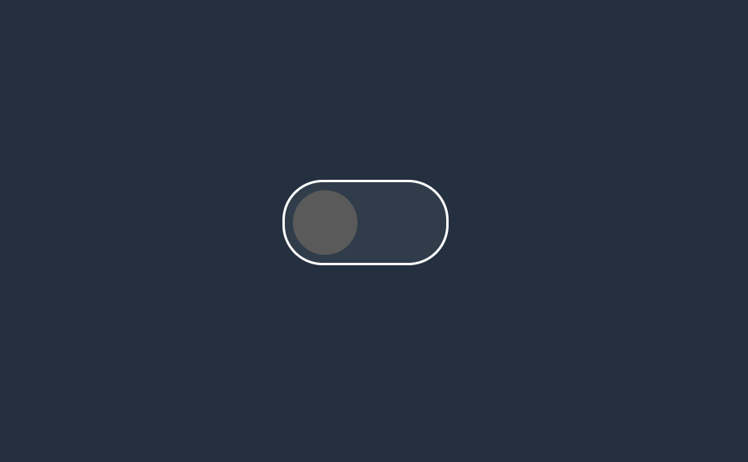

# Foobar

Create dynamic form with only html css and html




## Installation

Use the terminal to clone repository.

```bash
git clone https://github.com/yopaaa/dark-toggle.git
```

## Contributing

Pull requests are welcome. For major changes, please open an issue first
to discuss what you would like to change.

Please make sure to update tests as appropriate.

## License

[MIT](https://choosealicense.com/licenses/mit/)